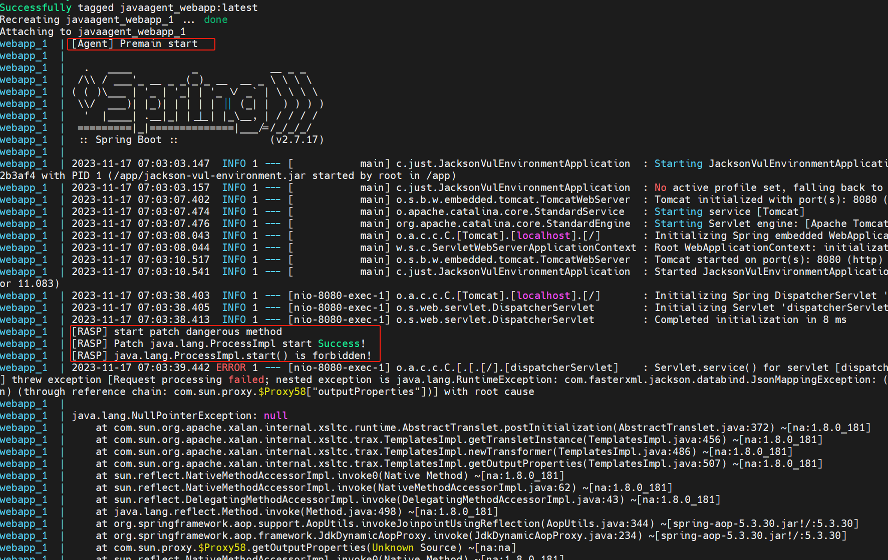

# 代码介绍

演示通过 `agent` 技术来实现 `rasp` 。并且通过 `docker` 搭建具有 `rasp` 保护的靶场，练习如何绕过 `rasp` 。这里的 `rasp` 保护是通过在启动主程序的时候添加 `-javaagent` 参数来实现的，而不是在程序运行的时候来 `attach` 。因为发现在 `Linux` 平台由于没有 `tools.jar` ，`attach` 就不太方便。具体原因在 `attach-agent` 中已经说过了。

